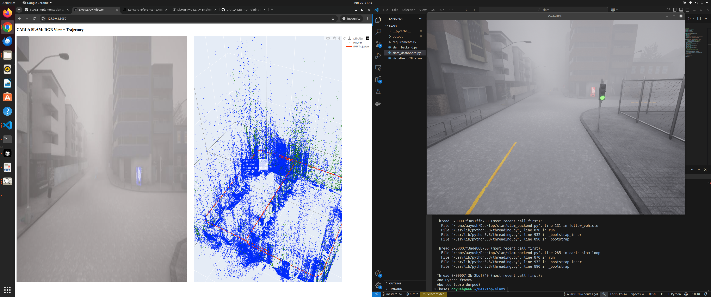
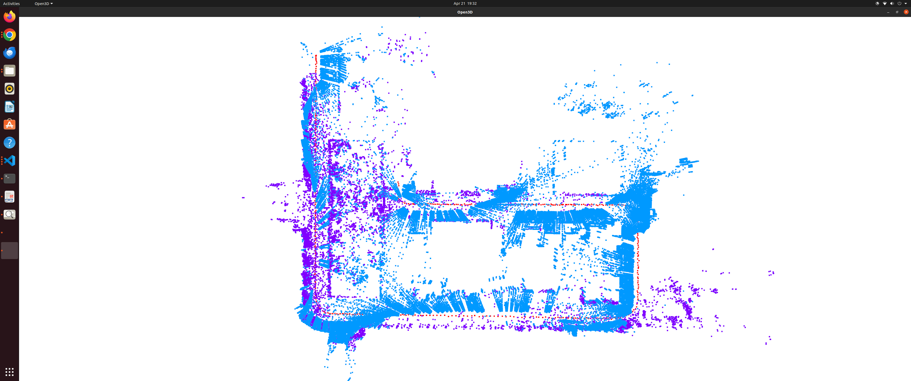
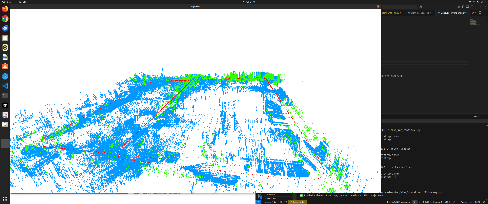
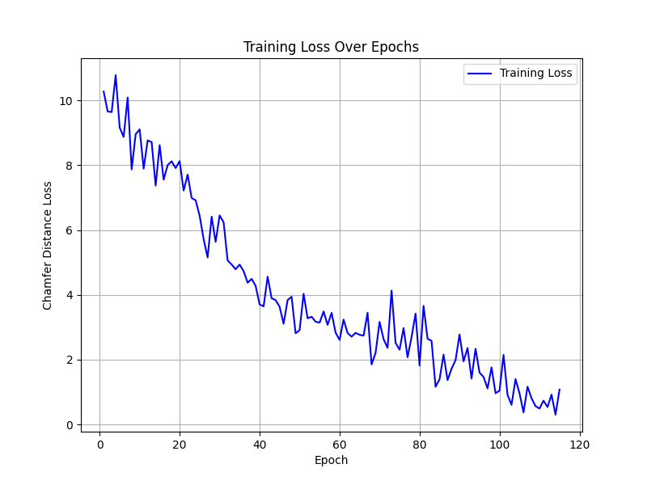

# Visibility-Aware Switching Between Radar & LiDAR

Autonomous robots often rely on LiDAR for precise localization and mapping (SLAM), but its performance degrades drastically in low-visibility conditions such as smoke or fog. While radar sensors are robust in such environments, they lack the spatial resolution needed for detailed mapping. To address this trade-off, we propose an adaptive sensor switching framework that dynamically toggles between LiDAR and radar based on environmental visibility. Our method enhances robustness, mapping fidelity, and energy efficiency by using only the most suitable sensor at a given time. Preliminary simulations in CARLA demonstrate the system’s potential for agile, all-weather operation—making it well-suited for disaster response and challenging real-world scenarios.

### Visualization


### LiDAR Prediction Point Cloud


### Radar-LiDAR Point Cloud Fusion


## Setup

1. Clone the repository:
   ```bash
   git clone https://github.com/AJaxRUN/Visibility_Aware_Switching_LiDAR_RADAR
   cd Visibility_Aware_Switching_LiDAR_RADAR
   ```

2. Install dependencies:
   ```bash
   pip install -r requirements.txt
   ```

3. Ensure you have the CARLA simulator installed and running.

## Usage

### 1. Collect Radar and LiDAR Dataset
Run the script to collect radar and LiDAR data:
```bash
python collect_radar_lidar_dataset.py
```

### 2. Train PointNet Model
Train the PointNet model for point cloud completion:
```bash
python train_pointnet.py
```

### 3. Visualize Results
Visualize the results using the offline map:
```bash
python visualize_offline_map.py
```

### 4. Main Entry Point
Run the main script to execute the entire pipeline:
```bash
python main.py
```


## Dataset

The `dataset/` directory contains `.npy` files representing LiDAR data collected during simulation. Each file corresponds to a specific frame.

### Radar-LiDAR Point Cloud Fusion


## Outputs

The `output/` directory stores results such as completed point clouds and visualizations generated by the scripts.

## Pre-trained Model

The repository includes a pre-trained PointNet model (`pointnet_completion.pth`) for point cloud completion. You can use this model directly or train your own using the provided script.

## License

This project is licensed under the MIT License. See the LICENSE file for details.

## Acknowledgments

- [CARLA Simulator](https://carla.org/) for providing a high-fidelity simulation environment.
- [PointNet](https://arxiv.org/abs/1612.00593) for inspiring the point cloud completion model.
